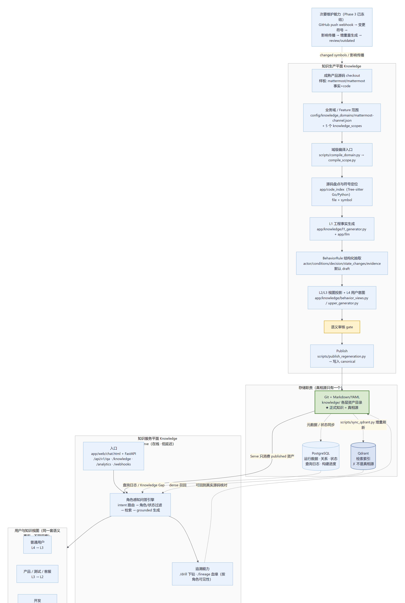
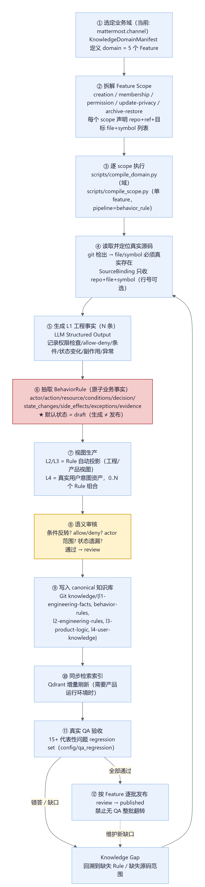
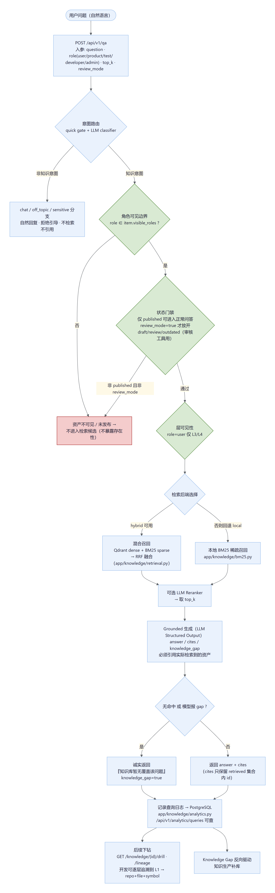
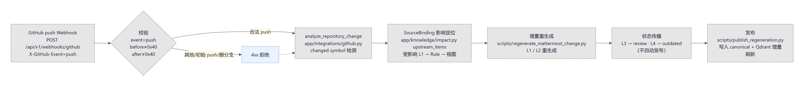
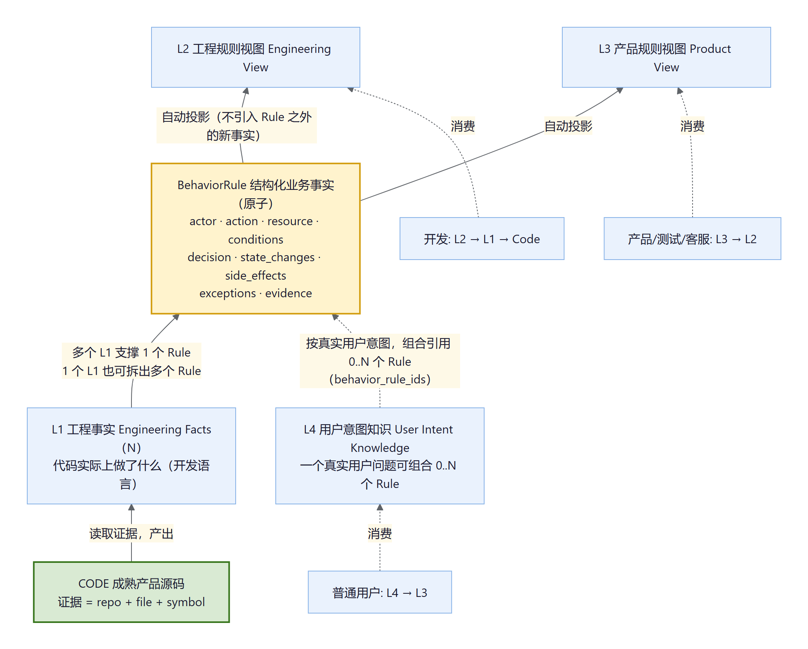

# 系统架构与流程图

本目录用 Mermaid 流程图展示 llmllm 的系统架构与核心流程。事实依据：`docs/architecture.md`、`docs/PRD.md`、`docs/roadmap.md` 以及当前代码实现。

- `*.mmd`：图的唯一源文件（可编辑、可版本化）。
- `*.png`：渲染结果（用于文档与问答展示）。

## 图 1 — 系统总览（两个运行面 + 存储职责）

- **知识生产平面（Build）**：成熟产品源码 → 业务域/Feature Scope → L1 → BehaviorRule → L2/L3/L4 → 语义审核 → 发布为 canonical 资产。当前主线。
- **知识服务平面（Serve）**：Web/FastAPI → 角色感知问答 → 下钻追溯；正常问答只消费 `published` 资产。
- **存储职责**：Git + Markdown/YAML 是唯一真相源；PostgreSQL 存运行数据/查询日志；Qdrant 只是检索索引。
- **次要维护能力**（GitHub push → 影响传播 → 增量重生成）已实现但冻结。

## 图 2 — 知识生产流程（编译 → 审核 → 发布）

Domain manifest → 逐 Feature scope 编译 → 真实源码 file/symbol 定位 → L1 → BehaviorRule（默认 draft）→ L2/L3 投影 + L4 用户意图 → 语义审核（review）→ 写入 canonical（Git 各层目录）→ 同步索引 → 真实 QA 验收 → **按 Feature 逐批发布**（review → published）。QA 失败转为 Knowledge Gap 驱动补库，禁止无 QA 整批发布。

## 图 3 — 服务问答流程（Serve / QA）

问题 → 意图路由 → 角色可见性 + published 状态门禁 + 层可见性 → 检索（本地 BM25 或 Qdrant+BM25 混合 RRF，可选 Reranker）→ Grounded 生成（answer/cites/knowledge_gap）→ 无命中时诚实返回缺口 → 查询日志 → 下钻/血缘追溯。`review_mode` 只服务知识审核工具，不进入正常问答。

## 图 4 — 增量维护流程（次要能力）

GitHub push webhook → 变更符号检测 → SourceBinding 影响定位 → 增量重生成 → review/outdated 状态传播 → 发布 + Qdrant 增量刷新。

## 图 5 — 知识层级语义模型

Code → L1（N）→ BehaviorRule（原子语义，默认 draft）→ L2/L3 自动投影；L4 按真实用户意图组织，可组合 0..N 个 Rule（多对多）。各层数量不要求相等；不同角色消费同一套事实的不同深度（user: L4→L3，产品/测试: L3→L2，开发: L2→L1→Code）。

## 重新渲染

1. 编辑 `*.mmd`；
2. 用任一支持 Mermaid 的渲染器（如 mermaid-cli、Typora、GitHub 预览）或本项目渲染脚本导出 PNG（渲染 HTML 模板见 `.scratch/diagram-render/*.html`，使用 mermaid 11 + headless Chrome）。
