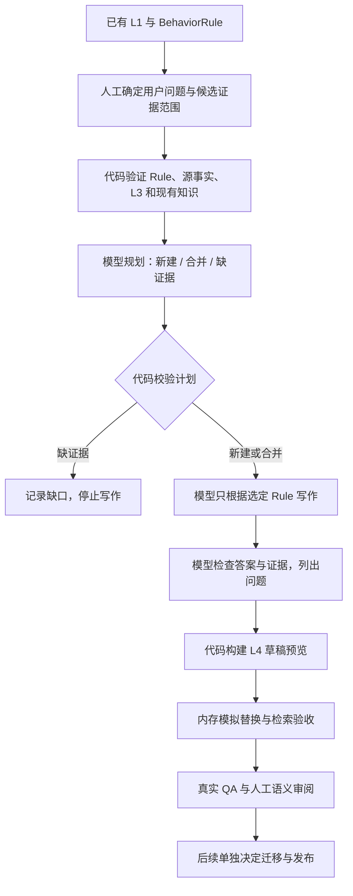
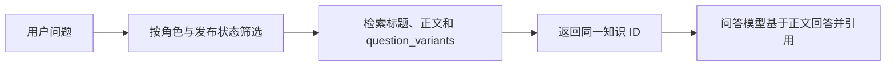

# 按用户问题构建 L4

L4 的单位是一个可以独立回答的用户问题。Rule 仍保留精确、可追踪的原子事实；写 FAQ 时，把共同解释一个场景的 Rule 组合起来。标准不以篇幅或 Rule 数量判断：一条 Rule 足够支撑完整问题，也可以单独形成 FAQ。

例如，“为什么我能创建公开频道，却不能创建私有频道？”需要组合两种创建权限规则；“额度受哪个配置控制？”通常是频道创建受限这一问题的一个解释点。同义问法放在同一知识的 metadata，不复制正文。



**代码控制什么：** 允许的证据和合并 ID、L1/L3 是否在相同 Feature 且经过审核、知识层级、可见角色、血缘和 `draft` 状态。未知 Rule、越界合并和重复替换会报错。

**提示词控制什么：** 如何界定完整问题、保留条件与例外、消除空洞表述、避免把必要条件当成成功保证，以及如何指出不受证据支持的建议。三步模型请求都加载同一个 [运行时写作规范](../app/llm/prompts/l4_authoring.md)，不是期待模型自行阅读项目文档。

**仍需要审阅什么：** 模型是否理解 Rule、合并是否合理、正文是否真的解决问题。结构校验无法证明语义正确，模型自审也可能漏错。操作入口、当前企业配置值、修复步骤没有证据时应记录缺口；不能为凑齐模板而编造。

## 生成草稿

在仓库根目录，使用已配置的 `LLM_PROVIDER=openai`、`LLM_MODEL`、`LLM_API_KEY`，以及可选 `LLM_BASE_URL` / `LLM_REASONING_EFFORT`：

```bash
.venv/bin/python -m scripts.compile_l4 \
  config/knowledge_intents/mattermost-channel-creation.json \
  --output /tmp/creation-l4-generated.json
```

意图清单由维护者选择用户问题、同义问法、候选 Rule 和允许合并的旧知识。模型在这个范围内提出计划；不负责自动扫描全库发现用户需求。缺证据的计划没有正文。写作、审核有结果的条目仍是草稿，审核意见和缺口保存在 preview metadata。

命令不发布、不改写原有 FAQ，也不会退役旧 ID。`--output` 必须是 canonical 目录之外的 JSON，不能覆盖输入清单。不指定时输出到 stdout。

## 验证检索与答案

仓库提供一份经过代码证据核对的五条 Creation 候选样本；它是人工与 Agent 整理的参考样本，**不是运行上面命令得到的真实模型结果**。

```bash
.venv/bin/python -m scripts.evaluate_l4 \
  docs/baselines/creation-l4-preview-2026-09-08.json \
  config/qa_regression/creation-l4-2026-09-08.json \
  --output /tmp/creation-l4-evaluation.json
```

评估器在独立内存 catalog 中移除被合并的旧 ID，把审核无问题的候选模拟为已发布，再以普通用户正常模式检索。原 catalog、Markdown 文件和向量库不变。缺证据候选不替换任何旧条目。

默认只跑本地 BM25，报告候选排名、命中和旧 ID 是否残留。缺口问题也可能检索到相关知识，例如问“当前上限具体是多少”时命中额度解释。因此无模型时，缺口问答必须显示待验收，不能凭空检索结果判定拒答正确。

配置模型后加 `--with-llm` 可执行真实 QA responder，记录答案、引用和 Knowledge Gap，并检查机械条件。问题集中的 `required_claims` / `forbidden_claims` 是语义审阅标准，不用字符串包含关系冒充语义评分。最终还要检查答案有没有漏掉适用条件、乱推断数值或编造操作。该 CLI 也不代表 HTTP 端到端链路验收。

## 问答时如何检索



同义问法帮助召回，正文提供事实。既有向量索引需要正常同步才会包含新问法；本次离线样本没有写入向量库。草稿正式接入问答前，仍须完成 QA、审阅和旧条目迁移，不能直接翻转全部状态。
